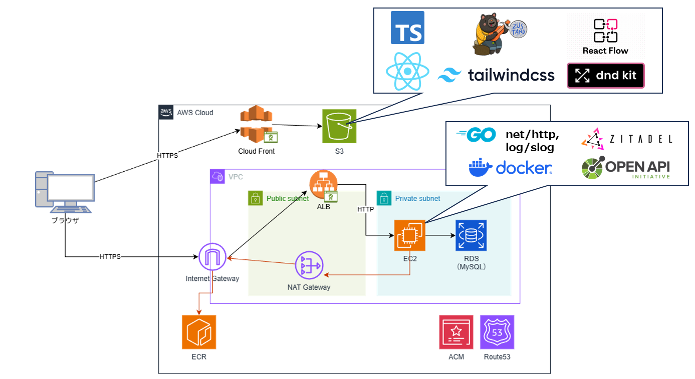

# 1. 本開発物の概要
### サービス概要

マインドマップとカンバンボードを連携させた、個人用タスク管理ツール「ミンカン」を開発しました。 
マインドマップの「構造化」とカンバンボードの「進行管理」の長所を併せ持つため、 タスクの全体像を俯瞰しながら、実行順や状態（着手中／待ち／完了 など）を一貫して管理できます。

サービスはリンク先から利用可能です。 
▶ [ミンカンアプリURL](https://www.mindmap-kanban.com/)
 
 

### 開発背景

開発背景をリンク先のGoogleスライドで説明しています。 
▶ [開発背景_スライド](https://docs.google.com/presentation/d/1KLZ43FPNCTKcYka_5uqseI69ziR3VVaa15CUOSt6Is0/edit?usp=sharing
)
 
 

### 動作イメージ・機能

以下の動画から利用イメージ・その他機能をご覧いただけます。 
▶ [ミンカン_利用イメージ.mp4](https://drive.google.com/file/d/10dDOswrx0erzBTTzMRiClXx8ac2xo5kj/view?usp=drive_link) 
▶ [ミンカン_その他機能.mp4](https://drive.google.com/file/d/1nhqyQ9MFGUwR5_mtTHsjOyMazjuckovQ/view?usp=sharing)
 
 

### github リポジトリ 

▶ [フロントエンド(Typescript/React/Tailwind/React Flow)](https://github.com/yopi416/mind-kanban-web) 
▶ [バックエンド(Go)](https://github.com/yopi416/mind-kanban-backend)
 
 

# 2. 技術概要

### システム構成図

 

### 使用技術・技術選定理由

| レイヤー        | 技術カテゴリ             | 採用技術                                                     | 採用理由                                 |
|----------------|--------------------------|--------------------------------------------------------------|------------------------------------------|
| **フロントエンド** | 言語                     | TypeScript 5.8.3                                             | 型定義によりバグを早期に検出でき、長期的な保守性が向上するため |
|                | JavaScriptライブラリ     | React 19.1.0 / React Router 7.9.1                           | ・将来バックエンド領域に注力する予定のため、フロントエンドは需要が高くエコシステムが成熟している技術を優先採用 ・React 自体の理解を深めることを優先したかったため、内部挙動がより抽象化されるNext.js は採用せず                        |
|                | CSSフレームワーク        | Tailwind CSS 4.1.8                                           | バックエンド志望でCSS設計に多くの時間を割きたくなかったため、スタイルをHTML/JSX側に直接書けるTailwindを採用                                       |
|                | UIコンポーネント         | shadcn/ui                                                    | UIデザインやコンポーネント設計を一から作り込む負荷を抑え、短時間でUIを整えられるため                                       |
|                | 静的解析 / フォーマッタ   | ESLint 9.28.0 / Prettier 3.5.3 / typescript-eslint 8.33.0    | 情報量が多く広く採用されているため                                       |
|                | 状態管理                 | Zustand 5.0.5                                                | ・Redux ほど学習コストが高くなく、今回の規模に適した状態管理だったため ・React Flow の公式サンプル実装でも利用されており、相性の良さが確認できたため           |
|                | マインドマップ            | React Flow 12.6.4                                            | ドキュメントやサンプルも豊富かつ、更新も盛んなため                                      |
|                | カンバンボード            | dnd-kit core 6.3.1       | ・カンバンボード機能を問題なく実装できることに加え、学習コストが低いため ・npm trendsで最も高い利用シェアを持つため                         |
|                | ホスティング             | S3 / CloudFront                                              | 低コストで高速な配信が可能であることに加え、商用でも広く利用されているため                                       |
| **バックエンド**  | 言語                     | Go 1.25.1                                                 | ・API開発との相性が良く、比較的高速に動作するサーバサイド言語であるため ・Webアプリに限らず、より低レイヤの処理やミドルウェア開発にも興味がある  ⇒Docker や Kubernetes などの開発でも採用されている Go を今後を見据えて採用                                       |
|                | HTTPサーバ               | net/http （フレームワーク未使用）                             | 理解を深めることを優先したかったため、内部挙動がより抽象化されるフレームワークは使用しなかった                                       |
|                | 静的解析 / Linter        | go vet / golangci-lint                                       | 広く利用されているため                                |
|                | フォーマッタ             | gofmt                                                        | 同上                                       |
|                | API                      | OpenAPI（oapi-codegen 2.5.0）                                | 型安全なハンドラ／クライアントコード を自動生成でき、手書きによる定義ミスや保守コストを削減できると判断したため                     |
|                | 認証 (OIDC)              | Zitadel/oidc 3.45.0                                          | 追加コストがかかることに加え、より処理が抽象化されるマネージドサービスは避けたかったため                                     |
|                | ログ                     | slog                                                         | 構造化ロギングのGo標準ライブラリのため                     |
|                | ホスティング             | EC2/Docker/ECR                                                          | コストを抑えるためにEC2にデプロイしているが、今後はFargateへの移行を検討中                                       |
|                | DB                       | RDS / MySQL 8.4                                              | 利用経験があったことに加え、今回の要件を問題なく実現できると判断したため                        |

 

### 技術面での工夫・苦労した点
- 1次情報を泥臭くチェックした
    - Zustand, ReactFlow, dnd-kitなどについて、日本語でリッチに記載されている記事がほとんどない状況
    - そのため、公式の英語Referenceやサンプルコードを1つ1つ読み解いた
    - 更に詳細な情報については、githubのDiscussionに情報が落ちていないかをチェックした
    - 上記を行った上で分からない情報は、自身で検証を行い挙動を確認
- マインドマップ構築について、ReactFlow標準機能だけでは実現できない操作を自前で実装した
    - 例: ノードの付け替え、子ノードを含めた再帰的削除、操作を戻す/進む etc・・・
- フレームワークに過度に依存せず、挙動理解を優先した
    - Next.js や Go の Gin/Echoは未使用
